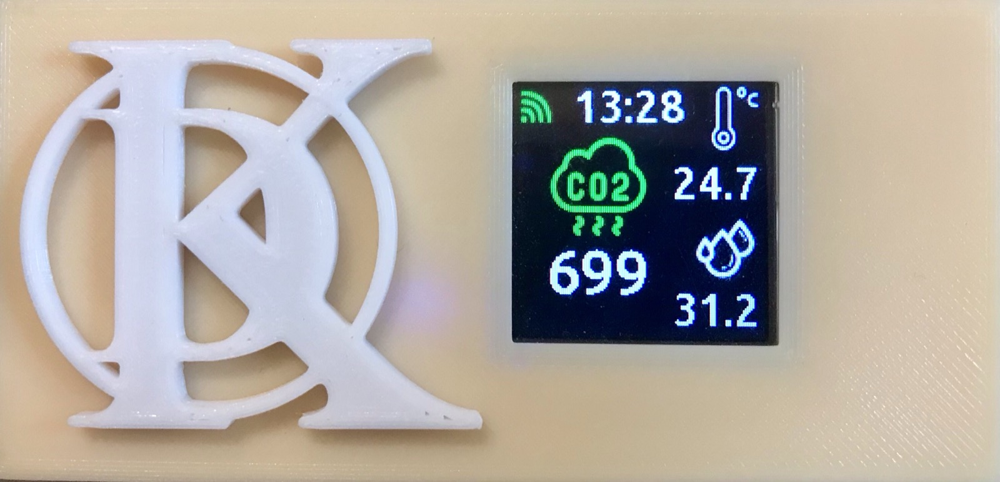

# HomeAirSensor
1.4" LCD Air quality monitor (BME280, RTC_DS1307, MHZ19) as a homeassistant MQTT Sensor integration with discovery

## Depends on libraries:
 - xdzmkus/ArduLibs
 - lvgl
 - others...
