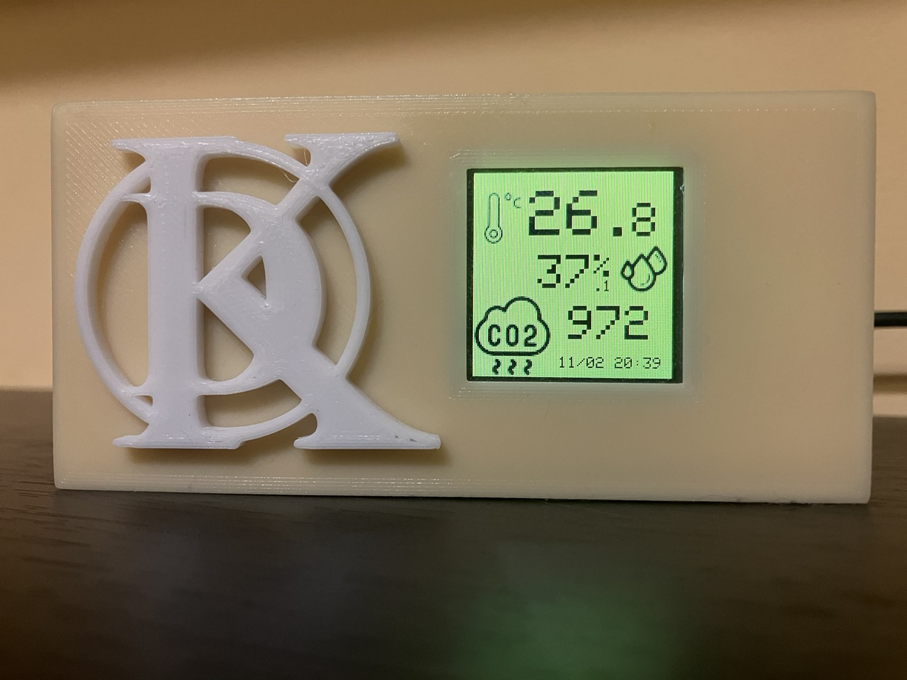

# HomeAirSensor
1.4" LCD ESP8266 Air quality monitor (BME280, RTC_DS1307, MHZ19) as a homeassistant MQTT Sensor integration with discovery

## Depends on libraries:
 - xdzmkus/ArduLibs
 - MH-Z19                                 
 - RTClib                                             
 - Adafruit BME280 Library                             
 - GFX Library for Arduino 
 - WiFiManager
 - PubSubClient
 - ArduinoJson                                         
 - Ticker
